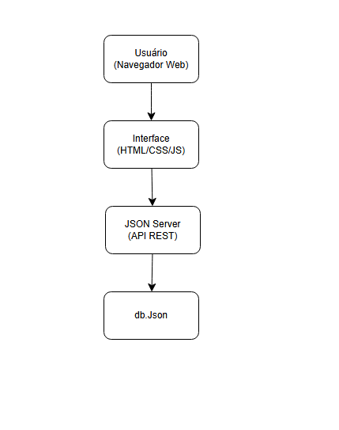
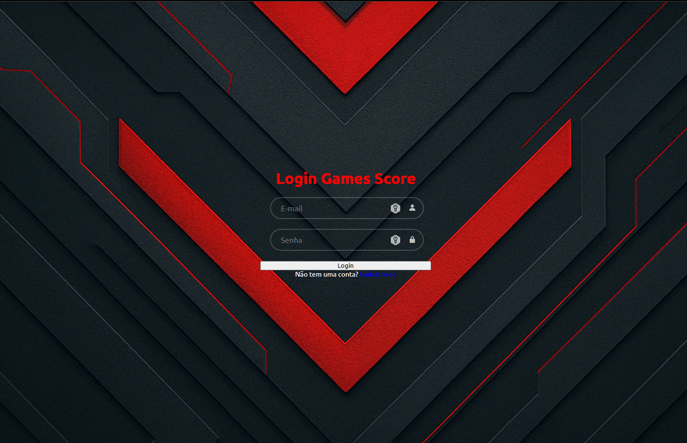
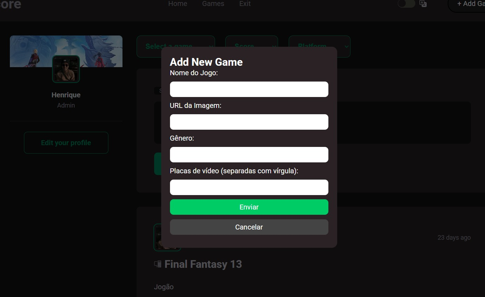
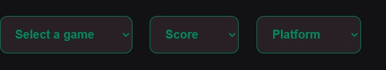
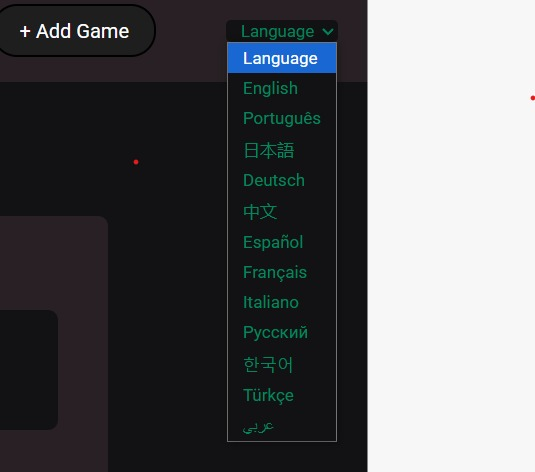
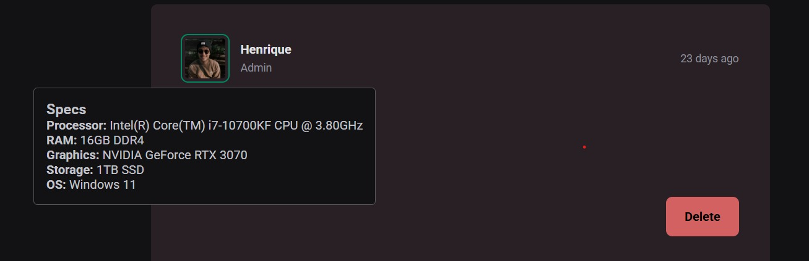

# Projeto da Solução

Pré-requisitos: <a href="4-Gestão-Configuração.md"> Ambiente e Ferramentas de Trabalho</a>

## Tecnologias Utilizadas

A solução foi desenvolvida utilizando as seguintes tecnologias:

- **HTML5 e CSS3**: Estruturação e estilização das páginas da plataforma.
- **JavaScript (Vanilla JS)**: Responsável pela lógica de interação com o usuário tanto no front-end quanto na comunicação com o back-end.
- **JSON Server**: Utilizado como back-end simulado (API REST fake) para persistência de dados como usuários, avaliações e reviews dos jogos.
- **Bootstrap**: Framework CSS para layout responsivo e componentes reutilizáveis.
- **VS Code**: Ambiente de desenvolvimento principal do grupo.
- **Live Server**: Ferramenta para rodar o front-end localmente e observar alterações em tempo real.

Essas tecnologias estão integradas de forma a permitir que o usuário interaja com o front-end (interface da plataforma), que por sua vez realiza requisições HTTP ao JSON Server, responsável por simular o comportamento de um banco de dados.

## Arquitetura da Solução

A arquitetura da aplicação foi planejada com base em uma separação de responsabilidades simples, com foco em um sistema de página única (SPA) e comunicação direta com o JSON Server. A imagem abaixo mostra a arquitetura lógica da aplicação:

### Descrição dos módulos:

- **Frontend (HTML, CSS, JS)**:
  - Responsável pela exibição e interação com o usuário.
  - Realiza requisições `GET`, `POST`, `PUT`, `DELETE` para o servidor JSON.
  
- **JSON Server**:
  - Simula um back-end com rotas e dados persistentes armazenados no `db.json`.
  - Suporta simulação de usuários, reviews, jogos, etc.

- **db.json**:
  - Arquivo com a estrutura de dados da aplicação (usuarios, games, reviews...).

Essa arquitetura permite um desenvolvimento rápido, ideal para MVPs e protótipos funcionais.

---

# Interface do Sistema

## Tela principal do sistema

A tela principal da plataforma apresenta um texto de boas-vindas e um formulário de login, onde os usuários podem acessar suas contas.

> A interface foi planejada para ser objetiva, com destaque ao conteúdo descritivo da proposta e um formulário claro para entrada de credenciais.

---

## Telas do requisito 1

### Cadastro e visualização de avaliações

> Essa tela permite ao usuário logado publicar comentários sobre jogos, avaliar por critérios (nota, plataforma, gênero) e visualizar o feed com avaliações de outros jogadores. Isso atende diretamente ao requisito funcional de permitir avaliações e visualização pública de reviews.

---

## Telas do requisito 2

### Tela de Perfil e Apresentação do Usuário

> Nesta tela, o usuário pode personalizar suas informações dentro da plataforma **Game Score**. As funcionalidades disponíveis incluem:

- **Editar o nome de usuário**: Campo onde o usuário pode inserir ou atualizar seu nome público, que será exibido em reviews e interações na plataforma.

- **Alterar a foto de perfil**: Campo para inserção de uma URL de imagem, permitindo ao usuário adicionar ou modificar seu avatar.

- **Definir a imagem de capa do perfil**: Campo onde o usuário pode incluir uma URL de imagem que será usada como banner ou imagem de fundo em seu perfil.

- **Salvar alterações**: Ao clicar no botão verde "Salvar", as informações são atualizadas no banco de dados (simulado via JSON Server). A atualização pode envolver uma requisição `PUT` ou `PATCH` para modificar os dados existentes.

> Esta tela visa melhorar a personalização e identidade visual do usuário dentro da plataforma, reforçando a proposta da Game Score como uma comunidade participativa e personalizável.

---

> **Nota**: As imagens utilizadas devem estar na pasta `docs/images` do seu projeto GitHub e com os nomes de arquivos adequados (`wireframe-login.png`, `wireframe-feed.png`, `wireframe-perfil.png`, etc). Certifique-se de atualizá-las conforme necessário no seu repositório.

## Telas do requisito 3

## Tela de Cadastro de Novo Jogo

Esta tela é exibida em forma de **modal** quando o usuário (com permissão de administrador) deseja cadastrar um novo jogo na plataforma **Game Score**. Ela permite inserir as principais informações necessárias para que o jogo seja exibido no sistema.

As funcionalidades disponíveis nesta tela incluem:

- **Nome do Jogo**: Campo de texto para inserir o título do jogo que será adicionado ao catálogo da plataforma.

- **URL da Imagem**: Campo para colar o link de uma imagem representativa do jogo (geralmente a capa ou imagem promocional). Essa imagem será exibida nos cards de listagem e nas páginas de detalhe.

- **Gênero**: Campo destinado à especificação do gênero do jogo (ex: RPG, Ação, Aventura, Estratégia, etc.).

- **Placas de vídeo**: Campo onde é possível listar quais placas de vídeo são recomendadas ou compatíveis com o jogo, separadas por vírgulas (ex: GTX 1050, RTX 3060).

- **Botão "Enviar"**: Ao ser clicado, os dados preenchidos são enviados para o backend simulado (JSON Server) via `POST`, adicionando o novo jogo ao banco de dados.

- **Botão "Cancelar"**: Fecha o modal sem realizar nenhuma alteração ou envio de dados.

> Essa funcionalidade atende diretamente aos requisitos funcionais relacionados à administração da plataforma, permitindo o cadastro de novos jogos de forma prática e estruturada.

## Telas do requisito 4

## Filtros de Busca e Navegação

A plataforma **Game Score** oferece três filtros principais para ajudar os usuários a refinar a exibição dos reviews de jogos de acordo com suas preferências. Esses filtros facilitam a navegação e a descoberta de conteúdo relevante.

### Funcionalidades:

- **Select a game**:  
  Permite ao usuário escolher um jogo específico para visualizar apenas os comentários e avaliações relacionados a ele. Ideal para quando se deseja consultar a reputação de um título antes de jogar ou comprar.

- **Score**:  
  Este filtro possibilita selecionar avaliações com base na nota atribuída pelos usuários. Pode ser usado para ver apenas jogos bem avaliados ou para encontrar críticas negativas e entender os pontos fracos de certos títulos.

- **Platform**:  
  Filtra os jogos e avaliações conforme a plataforma utilizada (ex: PC, PlayStation, Xbox, Nintendo Switch, etc.). Isso é útil para saber se um jogo teve boa performance ou experiência em determinada plataforma.

> Os filtros podem ser combinados entre si, oferecendo uma busca mais precisa e eficiente dentro do catálogo de reviews da comunidade.

## Telas do requisito 5

## Menu de Seleção de Idioma

A plataforma **Game Score** oferece suporte multilíngue para atender usuários de diferentes nacionalidades e ampliar o alcance da comunidade gamer. O menu de seleção de idioma é apresentado em forma de dropdown e está localizado na parte superior da interface, ao lado do botão **+ Add Game**.

### Funcionalidades:

- **Dropdown de Idiomas**:  
  Ao clicar no botão, o usuário pode escolher entre uma variedade de idiomas disponíveis. A interface da aplicação é atualizada dinamicamente conforme a seleção feita.

### Idiomas Disponíveis:

- English 🇬🇧  
- Português 🇧🇷  
- 日本語 (Japonês) 🇯🇵  
- Deutsch (Alemão) 🇩🇪  
- 中文 (Chinês) 🇨🇳  
- Español (Espanhol) 🇪🇸  
- Français (Francês) 🇫🇷  
- Italiano 🇮🇹  
- Русский (Russo) 🇷🇺  
- 한국어 (Coreano) 🇰🇷  
- Türkçe (Turco) 🇹🇷  
- العربية (Árabe) 🇸🇦

> A inclusão dessa funcionalidade garante acessibilidade e usabilidade para um público global, reforçando o objetivo da Game Score de ser uma plataforma inclusiva e democrática.

## Telas do requisito 6

## Popover de Especificações do Computador

A plataforma **Game Score** permite que usuários exibam as especificações técnicas de suas máquinas diretamente no perfil ou em interações com a comunidade. As informações são apresentadas em um **popover** que aparece junto ao nome do usuário, permitindo fácil visualização.

### Informações exibidas:

- **Processor**: Modelo completo do processador utilizado pelo usuário.
- **RAM**: Quantidade e tipo de memória RAM instalada.
- **Graphics**: Modelo da placa de vídeo usada (GPU).
- **Storage**: Tipo e capacidade de armazenamento principal.
- **OS**: Sistema operacional instalado.

